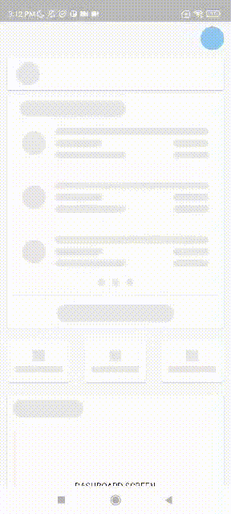
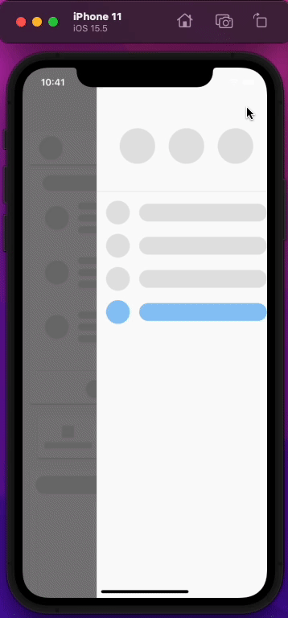

# Mx Crypto Component

MX Crypto Component is a component used to view crypto indices and prices.\
It is also part of the Certification Proof of Concept Plugin

## Usage

In the `pubspec.yaml` of your flutter project, add the following dependency:

```yaml
dependencies:
  ...
  mx_crypto_ui:
     path: mx_crypto_ui
```

In your library add the following import:

```dart
import 'package:mx_crypto_ui/mx_crypto_ui.dart';
```

## 🚀[Example](https://github.com/ThuyenPV/mx-flutter-components/tree/main/mx_crypto_ui/example)

```dart
import 'package:flutter/material.dart';
import 'package:mx_crypto_ui/mx_crypto_ui.dart';
import 'package:mx_flutter_components/dashboard/view/dashboard_screen.dart';

/// 1: Configure route name
MaterialApp(
      routes: {
          "DASHBOARD_SCREEN": (context) => const DashboardScreen(),
          "DASHBOARD_SCREEN": (context) => const MxCryptoScreen(),
          "MX_CRYPTO_DETAIL_SCREEN": (context) => const MxCryptoDetailScreen(),
      },
      onGenerateRoute: (settings) {
        switch (settings.name) {
          case DashboardScreen.route:
            return const MxCryptoScreen();
          case MxCryptoScreen.route:
            return const MxCryptoDetailScreen();
          case MxCryptoDetailScreen.route:
            return const DashboardScreen();
          default:
            return const UnknownPage();
        }
      },
    )

/// 2: Navigate to MxCryptoScreen of mx_crypto_ui package
Navigator.pushNamed(context, MxCryptoScreen.route);

```

## 🔥[Preview](https://github.com/ThuyenPV/mx-flutter-components/tree/main/screenshots)

|                                                |                                            |
| ---------------------------------------------- | ------------------------------------------ |
|  |  |
|                                                |                                            |

We're genuinely happy when received feedback from all ❤️
