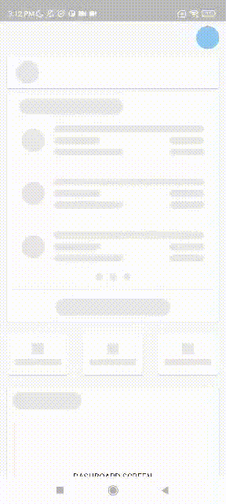

# Mx Flutter Components

---

## Getting Started 🚀

To run the desired flavor either use the launch configuration in VSCode/Android Studio or use the following commands:

```sh
# Command run application
$ flutter run
```

_\*Mx Flutter Components works on iOS, Android.

---

## Running Tests 🧪

To run all unit and widget tests use the following command:

```sh
$ flutter test --coverage --test-randomize-ordering-seed random
```

To view the generated coverage report you can use [lcov](https://github.com/linux-test-project/lcov).

```sh
# Generate Coverage Report
$ genhtml coverage/lcov.info -o coverage/

# Open Coverage Report
$ open coverage/index.html
```

---
## 🔥 Package Diagram


## 🔥 Demo Video
|                                                                                                                                                          |
| -------------------------------------------------------------------------------------------------------------------------------------------------------- |
| 
|                                                                                                                                                          |


We're genuinely happy when received feedback from all ❤️